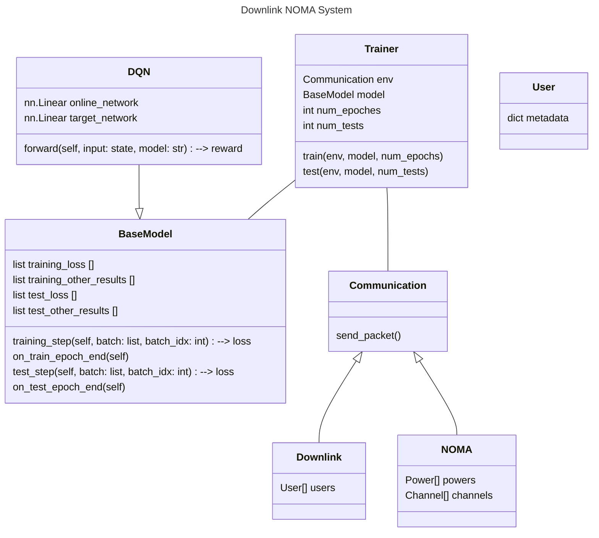

```mermaid
---
title: Downlink NOMA System
---
classDiagram

%% =====================================

class DQN {
    nn.Linear online_network
    nn.Linear target_network

    forward(self, input: state, model: str) --> reward
}

class BaseModel {
    list training_loss []
    list training_other_results []
    list test_loss []
    list test_other_results []

    training_step(self, batch: list, batch_idx: int) --> loss
    on_train_epoch_end(self)
    test_step(self, batch: list, batch_idx: int) --> loss
    on_test_epoch_end(self)
}

DQN --|> BaseModel

%% =====================================

class NOMA {
    Power[] powers
    Channel[] channels
}

class Downlink {
    User[] users
}

class Communication {
    send_packet()
}

Communication <|-- Downlink
Communication <|-- NOMA

%% =====================================

class Trainer {
    Communication env
    BaseModel model
    int num_epoches
    int num_tests

    train(env, model, num_epochs)
    test(env, model, num_tests)
}

Trainer -- BaseModel
Trainer -- Communication

%% =====================================

class User {
    dict metadata

}
```
