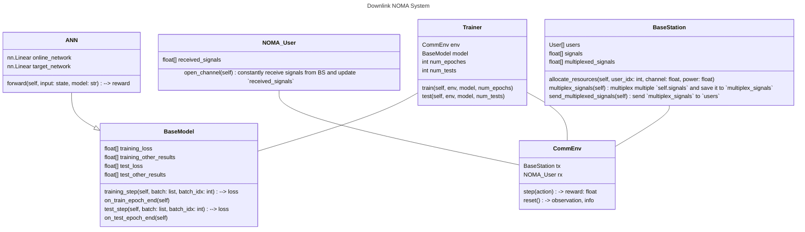

```mermaid
---
title: Downlink NOMA System
---
classDiagram

%% =====================================

class ANN {
    nn.Linear online_network
    nn.Linear target_network

    forward(self, input: state, model: str) --> reward
}

class BaseModel {
    float[] training_loss
    float[] training_other_results
    float[] test_loss
    float[] test_other_results

    training_step(self, batch: list, batch_idx: int) --> loss
    on_train_epoch_end(self)
    test_step(self, batch: list, batch_idx: int) --> loss
    on_test_epoch_end(self)
}

ANN --|> BaseModel

%% =====================================

class CommEnv {
    BaseStation tx
    NOMA_User rx

    step(action) -> reward: float
    reset() -> observation, info
}

class BaseStation{
    User[] users
    float[] signals
    float[] multiplexed_signals

    allocate_resources(self, user_idx: int, channel: float, power: float)
    multiplex_signals(self) multiplex multiple `self.signals` and save it to `multiplex_signals`
    send_multiplexed_signals(self) send `multiplex_signals` to `users`
}

class NOMA_User {
    float[] received_signals

    open_channel(self) constantly receive signals from BS and update `received_signals`
}

NOMA_User -- CommEnv
BaseStation -- CommEnv

%% =====================================

%% =====================================

class Trainer {
    CommEnv env
    BaseModel model
    int num_epoches
    int num_tests

    train(self, env, model, num_epochs)
    test(self, env, model, num_tests)
}

Trainer -- BaseModel
Trainer -- CommEnv

%% =====================================
```
