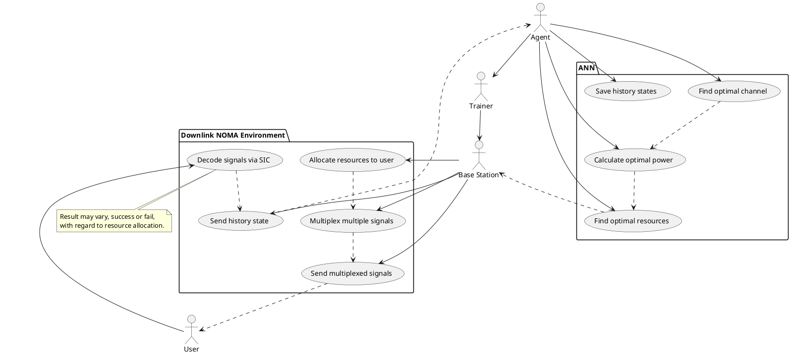

```plantuml
@startuml

actor "Base Station" as bs
actor "Agent" as ag
actor "User" as usr

package "ANN" {
    usecase "Find optimal channel" as uc1
    usecase "Calculate optimal power" as uc2
    usecase "Find optimal resources" as uc3
    usecase "Save history states" as uc4
}
ag --> uc1
ag --> uc2
ag --> uc3
ag --> uc4
uc1 ..> uc2
uc2 ..> uc3
uc3 ..> bs

package "Downlink NOMA Environment" {
    usecase "Allocate resources to user" as ucd1
    usecase "Multiplex multiple signals" as ucd2
    usecase "Send multiplexed signals" as ucd3
    usecase "Decode signals via SIC" as ucd4
    usecase "Send history state" as ucd5
}
note "Result may vary, success or fail, \nwith regard to resource allocation." as n1
ucd4 .. n1

bs --> ucd1
bs --> ucd2
bs --> ucd3
bs --> ucd5
ucd1 ..> ucd2
ucd2 ..> ucd3
ucd3 ..> usr
ucd4 ..> ucd5
ucd5 ..> ag

usr --> ucd4

actor "Trainer" as t

ag --> t
t --> bs

@enduml
```
